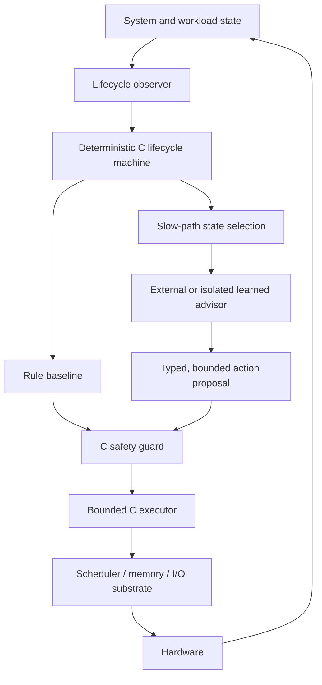

# FlowKernel

> A planned C-first experimental kernel researching lifecycle-aware,
> continuity-preserving, and AI-assisted resource scheduling.

**Evidence state: Planned. Implementation has not started.**

FlowKernel（流核）的长期目标是构建一个以 freestanding C 为可信核心的实验性操作系统内核，
研究操作系统能否不仅观察任务消耗了多少资源，还能理解任务所处的生命周期、真实进展和
连续运行价值，并据此改进长期资源策略。

本仓库现在只保存研究问题、架构假设、实验路线和证据规则。它不是一个已经可运行的内核，
也不把路线图描述成已实现能力。

## 实现契约

> C owns mechanism and enforcement; AI may only propose bounded policy.

- **The trusted core is C-first.** 内核主体使用受限的 freestanding C；只有启动、中断入口和
  上下文切换等硬件边界允许隔离、可枚举的最小汇编，不引入第二套策略逻辑。
- **Lifecycle is an explicit state machine.** Spring Boot 只提供生命周期问题的启发；内核使用
  自己的构造、绑定、启动、运行、降级、停止和回收状态，不移植应用框架。
- **AI is advisory.** AI 负责识别状态、评估长期策略并提出动作建议。
- **Enforcement remains deterministic.** C 状态机、Guard 和有限动作执行器负责约束和执行；
  模型缺席、超时或失效时，确定性基线仍能独立运行。
- **Safety invariants are not learned policies.** 权限、硬资源上限、最低保障、紧急资源和
  迁移前有效检查点等约束不能交给奖励函数自行领悟。
- **Mechanism and policy stay separated.** 学习系统可以调整策略，但不重写上下文切换、
  中断、页分配和锁等底层机制。
- **Continuity first, peak controlled.** 对正在取得真实进展的长任务优先控制峰值并保持
  连续性，而不是仅根据瞬时占用粗暴终止。

## 研究对象

最终研究对象是自研的 C-first 实验内核，但不会一开始追求驱动、文件系统、网络和多节点
能力齐全。工程上分成两个可比较边界：

- **FlowKernel target：** 用受限 freestanding C 建立最小可启动内核、显式生命周期状态机、
  确定性调度基线、C Guard 和可回退动作执行器；
- **Linux reference lab：** 使用 Linux、cgroup、`sched_ext` 和 eBPF 作为传统对照组、观测
  实验台与早期假设验证工具，不把实验台结果冒充 FlowKernel 内核能力。

在这两个边界上逐步研究：

- 进程、容器和长周期 Agent workload 的生命周期建模；
- CPU、内存、I/O、网络和加速器资源预算；
- 重试、停滞、检查点、迁移和恢复等长期状态；
- Attention 或状态筛选对高维系统观测的压缩；
- 规则、模仿学习和强化学习策略的可比较演进；
- 单节点到多节点的放置、限流、暂停、迁移和恢复；
- 吞吐、延迟、公平、能耗、完成率和工作流连续性的多目标权衡。

## 候选结构

微秒到毫秒级的 **Fast Path** 继续使用确定性算法。AI 只进入秒级到分钟级的
**Slow Path**，处理预算调整、异常模式、检查点、迁移和长期优先级。

## 路线图

| 阶段 | 研究目标 | 当前状态 |
| --- | --- | --- |
| R0 | 固定 C 工具链、启动契约、传统策略和 workload 对照基线 | Planned |
| R1 | 最小可启动 C 内核与显式生命周期状态机 | Planned |
| R2 | 确定性调度、资源回收、C Guard 与故障回退 | Planned |
| R3 | 生命周期观测、状态筛选、Attention 与可解释性 | Planned |
| R4 | 模仿学习、强化学习与受限动作提案 | Planned |
| R5 | workload 连续性、检查点、迁移与恢复 | Planned |
| R6 | 多核/多节点、故障注入、公平性和长期稳定性 | Planned |
| R7 | Agent、模型训练和推理 workload 的对照验证 | Planned |

阶段编号表示依赖关系，不代表承诺日期。每一阶段只有形成可重复实验和对照证据后，才会
从 `Planned` 更新为 `Validated`。

## 文档

- [概念起源](docs/conceptual-origin.md)
- [C-first 内核契约](docs/c-first-kernel-contract.md)
- [愿景与边界](docs/vision.md)
- [研究问题](docs/research-questions.md)
- [架构假设](docs/architecture-hypotheses.md)
- [实验路线](docs/experiment-roadmap.md)
- [证据规则](docs/evidence-policy.md)
- [前人工作与阅读地图](docs/prior-art.md)
- [威胁模型与安全不变量](docs/threat-model.md)

## 项目谱系

| 项目 | 主要问题 |
| --- | --- |
| [DarkRoomLibrary](https://github.com/NoctilumeDev/DarkRoomLibrary) | 增强型单体中的业务闭环与一致性 |
| [PlainJournal](https://github.com/NoctilumeDev/PlainJournal) | 分布式业务系统的可靠性、恢复与资源边界 |
| [PlainJournalPro](https://github.com/NoctilumeDev/PlainJournalPro) | 多商户平台、账本结算与异构服务治理 |
| FlowKernel | 生命周期感知的资源策略与 AI 系统研究 |

前三个项目在操作系统之上验证应用系统；FlowKernel 进一步研究底层资源分配策略。它们是
问题来源与控制组，不是 FlowKernel 已完成研究的证据。

## 当前不做

- 不宣称当前已有可运行内核，也不宣称正在替代 Linux；
- 不用“C 代码少”替代内存安全、并发安全、状态机和故障恢复设计；
- 不在最小闭环前同时铺开驱动、文件系统、网络栈、多核和分布式控制；
- 不让模型直接控制中断、时间片、内存页或内核权限；
- 不把所有 `if/else` 机械替换为强化学习；
- 不预选模型、强化学习算法或分布式控制平面；
- 不在没有基线、随机种子和失败证据时发布性能结论。

## License

[Apache License 2.0](LICENSE)
