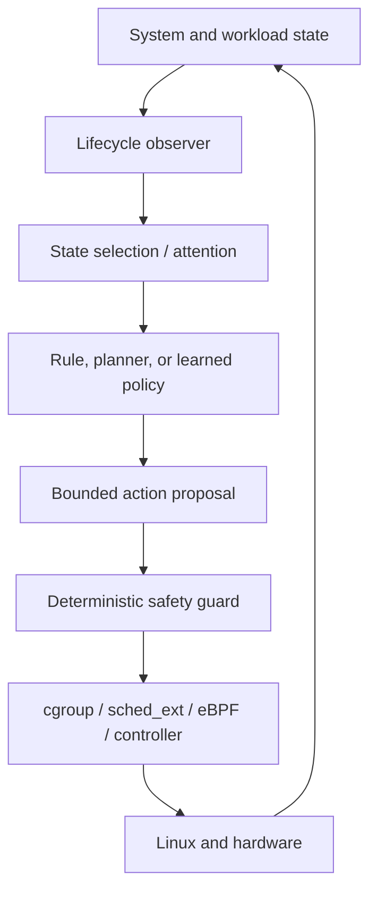

# FlowKernel

> A long-horizon systems research repository exploring lifecycle-aware,
> continuity-preserving, and AI-assisted resource scheduling.

**Evidence state: Planned. Implementation has not started.**

FlowKernel（流核）研究一个长期问题：操作系统能否不仅观察任务消耗了多少资源，还能理解
任务所处的生命周期、真实进展和连续运行价值，并据此改进长期资源策略。

本仓库现在只保存研究问题、架构假设、实验路线和证据规则。它不是一个已经可运行的内核，
也不把路线图描述成已实现能力。

## 核心原则

> AI may propose policy; deterministic mechanisms retain enforcement authority.

- **AI is advisory.** AI 负责识别状态、评估长期策略并提出动作建议。
- **Enforcement remains deterministic.** Linux scheduler、cgroup、`sched_ext`、eBPF
  等确定性机制负责约束和执行。
- **Safety invariants are not learned policies.** 权限、硬资源上限、最低保障、紧急资源和
  迁移前有效检查点等约束不能交给奖励函数自行领悟。
- **Mechanism and policy stay separated.** 学习系统可以调整策略，但不重写上下文切换、
  中断、页分配和锁等底层机制。
- **Continuity first, peak controlled.** 对正在取得真实进展的长任务优先控制峰值并保持
  连续性，而不是仅根据瞬时占用粗暴终止。

## 研究对象

第一阶段不从零编写完整操作系统，而是在 Linux 提供的可控边界上研究：

- 进程、容器和长周期 Agent workload 的生命周期建模；
- CPU、内存、I/O、网络和加速器资源预算；
- 重试、停滞、检查点、迁移和恢复等长期状态；
- Attention 或状态筛选对高维系统观测的压缩；
- 规则、模仿学习和强化学习策略的可比较演进；
- 单节点到多节点的放置、限流、暂停、迁移和恢复；
- 吞吐、延迟、公平、能耗、完成率和工作流连续性的多目标权衡。

## 候选结构

微秒到毫秒级的 **Fast Path** 继续使用确定性算法。AI 只进入秒级到分钟级的
**Slow Path**，处理预算调整、异常模式、检查点、迁移和长期优先级。

## 路线图

| 阶段 | 研究目标 | 当前状态 |
| --- | --- | --- |
| R0 | 建立传统调度器、静态规则和工作负载基线 | Planned |
| R1 | 单机生命周期观测与手写策略 | Planned |
| R2 | `sched_ext`、cgroup 与容器控制实验 | Planned |
| R3 | 状态筛选、Attention 与可解释观测 | Planned |
| R4 | 模仿学习、强化学习与确定性 Guard | Planned |
| R5 | 多节点放置、检查点、迁移与恢复 | Planned |
| R6 | 故障注入、公平性、连续性与奖励投机验证 | Planned |
| R7 | 面向 Agent、模型训练和推理的专项 workload | Planned |

阶段编号表示依赖关系，不代表承诺日期。每一阶段只有形成可重复实验和对照证据后，才会
从 `Planned` 更新为 `Validated`。

## 文档

- [愿景与边界](docs/vision.md)
- [研究问题](docs/research-questions.md)
- [架构假设](docs/architecture-hypotheses.md)
- [实验路线](docs/experiment-roadmap.md)
- [证据规则](docs/evidence-policy.md)
- [前人工作与阅读地图](docs/prior-art.md)
- [威胁模型与安全不变量](docs/threat-model.md)

## 项目谱系

| 项目 | 主要问题 |
| --- | --- |
| [DarkRoomLibrary](https://github.com/NoctilumeDev/DarkRoomLibrary) | 增强型单体中的业务闭环与一致性 |
| [PlainJournal](https://github.com/NoctilumeDev/PlainJournal) | 分布式业务系统的可靠性、恢复与资源边界 |
| [PlainJournalPro](https://github.com/NoctilumeDev/PlainJournalPro) | 多商户平台、账本结算与异构服务治理 |
| FlowKernel | 生命周期感知的资源策略与 AI 系统研究 |

前三个项目在操作系统之上验证应用系统；FlowKernel 进一步研究底层资源分配策略。它们是
问题来源与控制组，不是 FlowKernel 已完成研究的证据。

## 当前不做

- 不宣称正在构建可替代 Linux 的通用操作系统；
- 不让模型直接控制中断、时间片、内存页或内核权限；
- 不把所有 `if/else` 机械替换为强化学习；
- 不预选模型、算法、编程语言或分布式控制平面；
- 不在没有基线、随机种子和失败证据时发布性能结论。

## License

[Apache License 2.0](LICENSE)
