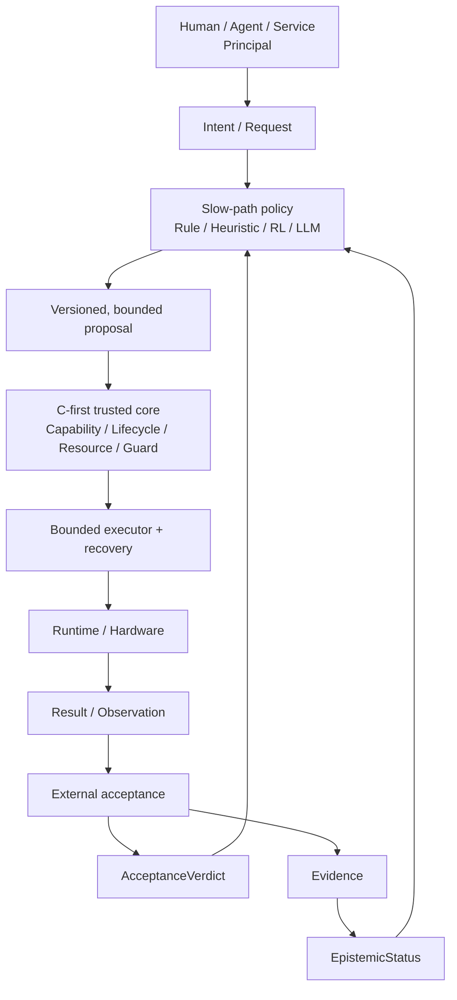

# FlowKernel

> A planned C-first experimental AI execution kernel researching how fallible
> policy can act inside deterministic authority, resource, isolation,
> provenance, and recovery boundaries.

**Evidence state: Planned. Implementation has not started.**

FlowKernel（流核）的长期目标是构建一个以 freestanding C 为可信核心的实验性 AI Execution
OS。它不试图让 AI 接管内核，也不假设人类拥有天然的最终正确性；它研究如何让规则、强化
学习、Agent 与大模型等不完全可靠的策略源，在确定性的身份、权限、资源、隔离、生命周期、
来源记录和恢复边界内提出并执行有界动作。

资源调度仍是第一个核心研究方向：操作系统能否不仅观察任务消耗了多少资源，还能理解任务
所处的生命周期、真实进展和连续运行价值，并据此改进长期策略。项目扩展的是这个问题的上游
边界——谁有权行动、行动留下什么历史、行动后的事实如何成立——不是推翻原始问题。

本仓库现在只保存研究问题、架构假设、实验路线和证据规则。它不是一个已经可运行的内核，
也不把路线图描述成已实现能力。

AI 调度、runtime assurance、shielding、Capability 与 agentic scheduler control plane 都有直接
前人工作。FlowKernel 不把这些零件单独宣称为新发明；它只把“多种策略源的运行时有界提案、
C-first 确定性执行边界、统一授权语义和独立事实验收”作为待反证的组合差异。精确覆盖关系和
必须复现的直接基线见[前人工作与阅读地图](docs/prior-art.md)。

FlowKernel 不是通用 Agent Harness。Prompt、上下文、记忆、规划、技能与工具选择属于不可信的
智能编排域；Harness 只能提交有类型的 `ActionProposal`，不能给自己签发 Capability，也不能
直接控制调度器。确定性权限边界负责约束行动，资源机制负责落实硬上限：

> Intelligence proposes. Authority constrains. Mechanism enforces.

“Harness 越狱不应自动成为权限提升”是需要由隔离、旁路测试和故障证据验证的设计不变量，
不是当前仓库已经实现的安全保证。

## 实现契约

> C owns mechanism and enforcement; policy sources may only propose bounded actions.

- **The trusted core is C-first.** 内核主体使用受限的 freestanding C；只有启动、中断入口和
  上下文切换等硬件边界允许隔离、可枚举的最小汇编，不引入第二套策略逻辑。
- **Lifecycle is an explicit state machine.** Spring Boot 只提供生命周期问题的启发；内核使用
  自己的构造、绑定、启动、运行、降级、停止和回收状态，不移植应用框架。
- **AI is advisory.** AI 负责识别状态、评估长期策略并提出动作建议。
- **Competence is not authority.** 人、Agent、服务及策略运行时作为 Principal；规则、模型和
  policy 是带版本的 Artifact。会做、建议或批准某件事，不自动获得对目标 Object 的执行权。
- **Enforcement remains deterministic.** C 状态机、Guard 和有限动作执行器负责约束和执行；
  模型缺席、超时或失效时，确定性基线仍能独立运行。
- **Safety invariants are not learned policies.** 权限、硬资源上限、最低保障、紧急资源和
  迁移前有效检查点等约束不能交给奖励函数自行领悟。
- **Mechanism and policy stay separated.** 学习系统可以调整策略，但不重写上下文切换、
  中断、页分配和锁等底层机制。
- **Harness, authority and resource mechanism stay separated.** 智能编排、确定性授权与资源
  落实只共享版本化合同，不共享凭据、执行入口、可变状态或故障域。
- **Execution is not truth.** `ALLOW` 只表示动作获准，`SUCCEEDED` 只表示执行器报告完成；
  关于现实的声明仍需独立读回和证据裁决。
- **Every privileged transition has provenance and recovery.** 记录 Principal、授权、目标、前后
  状态、结果与恢复引用；记录本身仍需身份、完整性和外部验收约束。
- **Continuity first, peak controlled.** 对正在取得真实进展的长任务优先控制峰值并保持
  连续性，而不是仅根据瞬时占用粗暴终止。

## 研究对象

最终研究对象是自研的 C-first 实验内核，但不会一开始追求驱动、文件系统、网络和多节点
能力齐全。工程上分成两个可比较边界：

- **FlowKernel target：** 用受限 freestanding C 建立最小可启动内核、显式生命周期状态机、
  有界能力与资源边界、确定性基线、C Guard、动作执行器和恢复钩子；
- **Linux reference lab：** 使用 Linux、cgroup、`sched_ext` 和 eBPF 建立传统对照组与现有
  agentic control-plane 直接基线，并作为观测实验台和早期假设验证工具；不把实验台结果冒充
  FlowKernel 内核能力。

在这两个边界上逐步研究：

- Principal、Object、Capability、委托、撤销和执行所有权；
- 进程、容器和长周期 Agent workload 的生命周期建模；
- CPU、内存、I/O、网络和加速器资源预算；
- 重试、停滞、检查点、迁移和恢复等长期状态；
- Attention 或状态筛选对高维系统观测的压缩；
- 规则、模仿学习和强化学习策略的可比较演进；
- 单节点到多节点的放置、限流、暂停、迁移和恢复；
- 特权转换的来源记录、独立验收与事实资格；
- 维护者换机、凭据轮换和托管平台失效后的工程连续性；
- 吞吐、延迟、公平、能耗、完成率和工作流连续性的多目标权衡。

## 候选结构

微秒到毫秒级的 **Fast Path** 继续使用确定性算法。概率策略只进入秒级到分钟级的
**Slow Path**，处理预算调整、异常模式、检查点、迁移和长期优先级。C-first 可信核心负责
授权与执行边界；外部验收产生 AcceptanceVerdict 和 evidence，后者才能支持 EpistemicStatus。
两者不能
互相替代。

## 路线图

| 阶段 | 研究目标 | 当前状态 |
| --- | --- | --- |
| R0 | 固定宪法、可信边界、C 工具链、传统与 agentic 基线、干净机器恢复协议 | Planned |
| R1 | 最小可启动 C 内核、静态 Principal/Object 句柄与生命周期状态机 | Planned |
| R2 | 确定性能力、资源和隔离 Guard，有限执行器与故障回退 | Planned |
| R3 | 特权转换来源记录、恢复与外部验收交接 | Planned |
| R4 | 生命周期观测、状态筛选、Attention 与可解释性 | Planned |
| R5 | 规则、模仿学习、强化学习与受限动作提案 | Planned |
| R6 | workload 连续性、检查点、迁移、委托和撤销 | Planned |
| R7 | 多核/多节点、AI workload、故障注入和长期稳定性 | Planned |

阶段编号表示依赖关系，不代表承诺日期。每一阶段只有形成可重复实验和对照证据后，才会
从 `Planned` 更新为 `Validated`。

路线按架构层分成三个后续阶段带：R1–R3 建立确定性执行、权限与证据底座，R4–R5 只在其上研究
不可信观测和策略，R6–R7 再扩展连续性与规模。R0 的职责不是提前堆模块，而是冻结这些依赖
方向、交接合同、状态所有权和阶段门禁。分层表示高内聚模块与单向依赖，不表示每层都拆成
微服务；是否增加进程或地址空间边界，只由安全、故障与资源隔离证据决定。详细规则见
[实验路线](docs/experiment-roadmap.md#阶段带与依赖方向)。

## 文档

- [概念起源](docs/conceptual-origin.md)
- [执行操作系统宪法](docs/execution-os-constitution.md)
- [C-first 内核契约](docs/c-first-kernel-contract.md)
- [愿景与边界](docs/vision.md)
- [研究问题](docs/research-questions.md)
- [架构假设](docs/architecture-hypotheses.md)
- [实验路线](docs/experiment-roadmap.md)
- [证据规则](docs/evidence-policy.md)
- [前人工作与阅读地图](docs/prior-art.md)
- [威胁模型与安全不变量](docs/threat-model.md)

## 项目谱系

| 项目 | 主要问题 |
| --- | --- |
| [DarkRoomLibrary](https://github.com/NoctilumeDev/DarkRoomLibrary) | 增强型单体中的业务闭环与一致性 |
| [PlainJournal](https://github.com/NoctilumeDev/PlainJournal) | 分布式业务系统的可靠性、恢复与资源边界 |
| [PlainJournalPro](https://github.com/NoctilumeDev/PlainJournalPro) | 多商户平台、账本结算与异构服务治理 |
| [VeriTrail](https://github.com/NoctilumeDev/VeriTrail) | 受控执行、事实读回、失败保留与外部验收 |
| [JPyxis](https://github.com/NoctilumeDev/JPyxis) | 异构计算中控制、定义、运行时与合同的解耦 |
| FlowKernel | 概率策略如何在确定性行动、权限、来源和恢复边界内运行 |

前三个应用项目提供所有权、资源、故障与恢复样本；VeriTrail 提供独立验收和事实资格方法；
JPyxis 研究异构计算能力怎样通过合同挂载而不共享控制权；FlowKernel 研究这些约束如何进入
执行底座。集成的是失败后留下的边界思想，不是把现有项目代码拼进内核。它们都是问题来源与
控制组，不是 FlowKernel 已完成研究的证据。

## 当前不做

- 不宣称当前已有可运行内核，也不宣称正在替代 Linux；
- 不用“C 代码少”替代内存安全、并发安全、状态机和故障恢复设计；
- 不在最小闭环前同时铺开驱动、文件系统、网络栈、多核和分布式控制；
- 不让模型直接控制中断、时间片、内存页或内核权限；
- 不把人工批准当作最终真值，也不把 provenance 当作事实裁决；
- 不把所有 `if/else` 机械替换为强化学习；
- 不预选模型、强化学习算法或分布式控制平面；
- 不在尚无真实社区时宣称多主体治理已经得到验证；
- 不在没有基线、随机种子和失败证据时发布性能结论。

## License

[Apache License 2.0](LICENSE)
