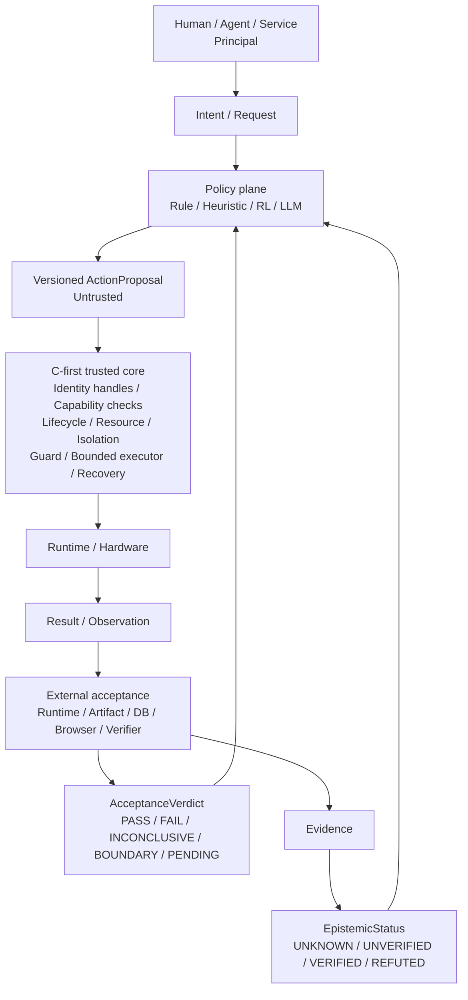

# 执行操作系统宪法

**Evidence state: Designed. No implementation has been validated.**

本文定义 FlowKernel 从“生命周期感知的资源策略研究”继续演化时，哪些边界不能被后续实现、
模型能力或社区规模冲掉。它是一份研究宪法，不是模块清单，也不证明多主体治理、能力系统、
来源记录或外部验收已经实现。

## 1. 演化后的问题

FlowKernel 最初追问：操作系统能否理解 workload 所处的生命周期、真实进展和连续运行价值，
而不只根据瞬时资源占用做决定。这个问题仍然成立，资源调度仍是第一个核心研究方向。

后续工程实践又暴露了一个更上游的问题：规则、强化学习、Agent、大模型和人类维护者都可能
给出局部合理、整体错误的判断。单纯提高模型能力，或者把人工审批放在流程末端，都不能证明
行动正确。系统需要回答：

> How can fallible intelligence act without becoming sovereign?

FlowKernel 因而扩展为一个规划中的 C-first AI Execution OS 研究项目：它研究如何让不完全
可靠的策略源在确定性的身份、权限、资源、隔离、生命周期、来源记录和恢复边界内提出并执行
有界动作，使智能可以犯错，但错误不能自然升级为系统级失控或未经验证的工程事实。

这不是重写项目起源。原始资源策略问题、C-first 可信核心、Fast/Slow Path、确定性 Guard 和
Linux reference lab 都继续保留；新增的是行动权、事实资格、治理权和工程连续性边界。

## 2. 基本对象与术语

本文只固定需要跨阶段保持一致的概念，不预先冻结实现模块。

| 概念 | 含义 |
| --- | --- |
| Principal | 发起、委托或承担行动责任的主体；人、Agent、服务和未来的组织身份都属于 Principal |
| Object | 被读取、修改、调度、迁移或治理的系统对象 |
| Capability | 指向特定 Object、携带有限权利并可被校验的授权载体；在能力安全语义中，它本身授予有界 authority |
| Proposal | 规则、启发式、RL、LLM 或人工提出的候选动作，不自带执行权 |
| Authorization | Guard 根据 Principal、Capability、Object、状态和预算作出的 `ALLOW`、`CLAMP` 或 `DENY` |
| Action | 执行器实际尝试的有界状态转换 |
| Observation | 对执行过程或结果的观测；可能缺失、延迟、错误或被污染 |
| Evidence | 能被定位、读回并用于支持或反驳声明的观察材料 |
| EpistemicStatus | 关于现实的声明当前获得的事实资格 |
| AcceptanceVerdict | 一次有明确 Subject、环境与边界的验收 run 得到的结果 |

规则、模型和 policy 是由 Principal 使用的版本化 Artifact，不因为能生成 Proposal 就自动成为
持有 Capability 的身份主体；承载它们的 Agent、服务或策略运行时才承担身份与行动责任。

因此需要保持两条区别：

```text
Model competence != execution authority
Capability holder  != truth owner
```

模型“会做”不等于模型“有权做”；持有执行权、完成一次动作，也不等于关于现实的声明已经成立。

## 3. 不能混用的状态轴与验收结果

| 状态轴 | 候选状态 | 回答的问题 |
| --- | --- | --- |
| Research maturity | `Idea / Planned / Designed / Prototype / Validated / Rejected` | 研究成熟到哪里？ |
| Authorization | `ALLOW / CLAMP / DENY` | 这个动作是否有权发生？ |
| Execution | `SUCCEEDED / FAILED / PARTIAL / UNKNOWN` | 动作实际执行成什么状态？ |
| EpistemicStatus | `UNKNOWN / UNVERIFIED / VERIFIED / REFUTED` | 关于现实的声明获得了什么事实资格？ |
| AcceptanceVerdict | `PASS / FAIL / INCONCLUSIVE / BOUNDARY / PENDING` | 一次声明过边界的验收 run 得到什么裁决？ |

EpistemicStatus `UNKNOWN` 表示 Subject、声明或必要观察尚不足以进入验证；`UNVERIFIED` 表示声明已经
明确且可检查，但当前 evidence 尚未达到验证或反驳门槛。Execution `UNKNOWN` 则只表示动作
结果无法可靠读回，不能与前两者合并。

一个典型链条应当是：

```text
LLM claim            -> UNVERIFIED
typed proposal       -> ALLOW
bounded executor     -> SUCCEEDED
independent readback -> VERIFIED
```

其中：

```text
ALLOW != TRUE
SUCCEEDED != VERIFIED
```

AcceptanceVerdict 也不自动映射为认识状态：`PASS` 只能支持本次已声明 assertion 的
`VERIFIED`；`FAIL` 可能来自产品、执行器、验证器或宿主，只有事实反证才能支持 `REFUTED`；
`INCONCLUSIVE`、`BOUNDARY` 和 `PENDING` 都不能被升级为成功。资源不足、观测冲突或验收链
不完整时，系统必须保留 `UNKNOWN`、`PARTIAL` 或未验证状态。

## 4. 八条宪法边界

1. **概率智能默认不拥有执行主权或事实权。** 规则、启发式、RL、LLM、Agent 与人工判断都
   可以产生候选策略，但都不能仅凭自信把判断写成系统事实。
2. **所有行动主体都是 Principal。** Human、Agent、Service 的身份、能力与授权分开；人类
   可以定义目标和批准高风险动作，但不因处在流程末端就成为天然 Oracle。
3. **所有特权状态转换必须由确定性可信核心完整调停。** 不为作者、管理员、模型或“紧急
   情况”保留不可见旁路。
4. **硬不变量不可学习。** 权限范围、资源上限、隔离、最低保障、合法生命周期边、动作幅度、
   停止线和确定性 fallback 由可审查机制约束，不能交给 reward 自行领悟。
5. **特权状态转换必须留下可重建的因果来源。** 但 provenance 只说明记录声称发生了什么，
   不自动证明记录真实、结果正确或业务目标成立。
6. **错误必须被限制在已授权的隔离域内。** 预算、速率、冷却、租约、checkpoint、回退和恢复
   都服务于 fault containment，而不是把“模型永不出错”当作前提。
7. **没有普通 Principal 拥有无限、不可审计、不可约束、不可撤销的系统权力。** 高风险治理
   变化与 break-glass 必须显式、限域、限时、留痕，并具有撤销或恢复路径。
8. **UNKNOWN 必须得到保护，系统自身也必须可恢复。** 模型缺席、节点失败、维护者换机、
   凭据轮换或原托管平台失效，都不能自动抹掉系统事实与工程记忆。

这里的“没有绝对控制权”不是声称物理机所有者、固件、编译器或托管平台已经被 FlowKernel
消除。它表示在系统所声明的信任边界内，不给任何日常主体提供未经完整调停的 God Mode；
边界之外的根权限仍必须作为外部 failure domain 明确记录。

## 5. 候选控制链



这个结构故意保留两条边界：

- C-first 可信核心负责“动作能否发生、怎样有界发生、失败怎样回退”，不负责替业务世界宣布
  最终真值；
- 外部验收负责“行动后的现实究竟是什么”，但不直接修改被验对象、Guard 或历史记录。

VeriTrail、GitHub 门禁、数据库、浏览器和发布物读回可以为 Acceptance 提供方法或事实源，
但它们不会被机械塞进内核。FlowKernel 集成的是约束思想，不是把现有工具堆成一个产品套件。

## 6. 运行权与治理权

FlowKernel 必须区分：

- **Runtime authority：** 谁能让一次状态转换发生；
- **Governance authority：** 谁能改变允许哪些状态转换、谁能授予能力、哪些记录具有权威性。

运行时动作由 C Guard 完整调停。修改硬不变量、Guard、authority root、审计要求、特权动作集
或策略发布规则，则属于治理变化，必须成为独立、版本化、可回滚的对象。

成熟阶段可以研究职责分离和多人授权，但不能在单维护者阶段伪造社区治理。本仓库当前仍由
单一维护者和 GitHub 承载；这只能证明设计方向，不能证明多主体治理已经成立。第一阶段可先
落实“显式变更对象 + Pull Request + 确定性门禁 + 不可混淆历史”，以后再用真实社区参与反证
多人授权、委托、撤销与维护者更换。

break-glass 不是无条件 bypass。候选合同至少包括：明确 Principal、理由、作用域、到期时间、
受影响 Object、事前或事后复核要求、完整 provenance，以及恢复到正常权限图的路径。是否需要
双人规则由风险和阶段决定，不预先把组织规模写成内核机制。

## 7. Failure Containment Contract

FlowKernel 不以消除幻觉、误判或 reward hacking 为可交付目标。它要求错误影响被限制在已经
授权的隔离域内：

```text
Error impact is a subset of the authorized isolation domain.
```

任何策略源都不能因为一次错误判断而自然获得以下能力：

- 修改不属于该 Principal 的对象；
- 吃掉内核、Guard、恢复路径或关键 workload 的保留资源；
- 越过 resource envelope、动作幅度、速率与重试上限；
- 跨租户、跨恢复所有者或跨证据边界传播副作用；
- 删除确定性基线、checkpoint 或来源记录；
- 在结果未知时自动扩大权限或继续升压。

策略超时、崩溃、输出非法、版本不兼容、震荡或分布漂移时，系统必须在有界时间内进入声明过
的确定性 fallback。fallback 也需要测试和资源预算，不能只作为架构图上的箭头。

## 8. 来源记录、事实与恢复

每次特权转换至少应能重建：

```text
principal
request / proposal
input snapshot
policy and version
capability / authority
target object
resource and time budget
guard verdict
attempted and actual action
pre-state / post-state
result
checkpoint / recovery reference
evidence reference
```

逻辑上的 append-only 不能被描述成天然防篡改。来源记录的可信度还依赖身份、密钥、完整性
校验、存储边界和必要的外部锚点；记录缺失或相互冲突时，验收只能给出未验证或不确定结果。

恢复也不只指 workload migration：

| 层次 | 需要回答的问题 |
| --- | --- |
| Workload portability | 任务能否检查点、迁移和幂等恢复？ |
| Runtime portability | 固定合同能否在另一受支持平台重建？ |
| Maintainer portability | 原机器消失后，维护者能否从版本化资产恢复工程状态？ |
| Authority portability | 凭据能否撤销、轮换和重新签发，而不丢失项目控制链？ |
| Repository survivability | 主托管平台失效后，完整对象图、合同与关键证据能否恢复？ |

这些层次属于同一恢复哲学，但不应全部塞入最小 C scheduler。内核负责其声明范围内的运行时
恢复；仓库、构建、发布和维护者连续性由工程治理合同承担。

## 9. 当前不冻结的内容

本文不预先决定：

- FlowKernel 最终采用 seL4 式 capability space、句柄表还是其他权限表示；
- provenance 使用图数据库、事件流、文件还是其他载体；
- RL、LLM、Attention 或任何具体模型一定进入最终系统；
- 多节点、分布式证据库、高可用协调器或 GPU scheduler 的产品架构；
- 单维护者阶段以后采用何种社区角色、投票或发布制度。

候选核心抽象只有 Principal、Object、Capability、State、Proposal、Action、Artifact、Evidence
和 Recovery。它们的精确对象边界必须由最小实现、反例和前人工作继续压缩，不能由本文提前
注册成一座组件城市。

## 10. 停止条件

本轮文档对齐达到以下结果即可停止：项目身份、可信边界、状态轴、威胁模型、证据策略和路线图
指向同一问题；原始资源调度研究没有被抹除；后来形成的思想没有被伪装成项目起源；未来实现
仍必须从确定性最小闭环开始。

继续增加术语、层级或未来组件不会让这些边界更真实。只有实现、反例或更可靠的前人工作出现
后，才有资格修改这份宪法。
